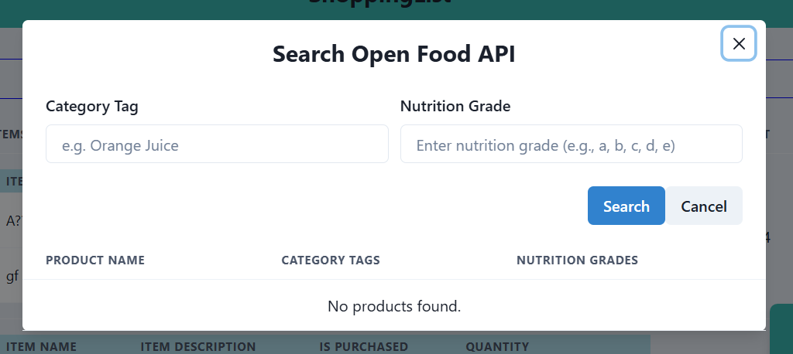
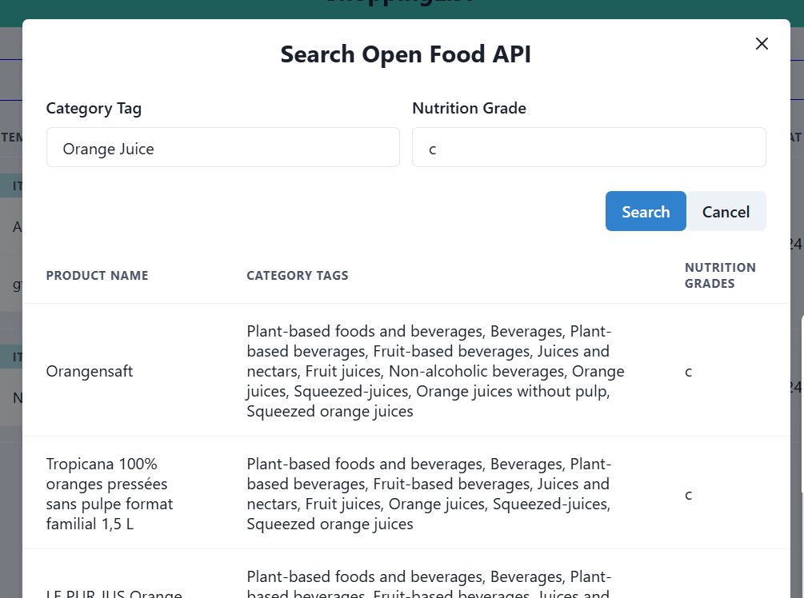

# FWE-WS-24-25-1120617

## Getting started

To make it easy for you to get started with GitLab, here's a list of recommended next steps.

Already a pro? Just edit this README.md and make it your own. Want to make it
easy? [Use the template at the bottom](#editing-this-readme)!

## Add your files

- [ ] [Create](https://docs.gitlab.com/ee/user/project/repository/web_editor.html#create-a-file)
  or [upload](https://docs.gitlab.com/ee/user/project/repository/web_editor.html#upload-a-file) files
- [ ] [Add files using the command line](https://docs.gitlab.com/ee/gitlab-basics/add-file.html#add-a-file-using-the-command-line)
  or push an existing Git repository with the following command:

```
cd existing_repo
git remote add origin https://code.fbi.h-da.de/sthiohnoo/fwe-ws-24-25-1120617.git
git branch -M main
git push -uf origin main
```

## Integrate with your tools

- [ ] [Set up project integrations](https://code.fbi.h-da.de/sthiohnoo/fwe-ws-24-25-1120617/-/settings/integrations)

## Collaborate with your team

- [ ] [Invite team members and collaborators](https://docs.gitlab.com/ee/user/project/members/)
- [ ] [Create a new merge request](https://docs.gitlab.com/ee/user/project/merge_requests/creating_merge_requests.html)
- [ ] [Automatically close issues from merge requests](https://docs.gitlab.com/ee/user/project/issues/managing_issues.html#closing-issues-automatically)
- [ ] [Enable merge request approvals](https://docs.gitlab.com/ee/user/project/merge_requests/approvals/)
- [ ] [Set auto-merge](https://docs.gitlab.com/ee/user/project/merge_requests/merge_when_pipeline_succeeds.html)

## Test and Deploy

Use the built-in continuous integration in GitLab.

- [ ] [Get started with GitLab CI/CD](https://docs.gitlab.com/ee/ci/quick_start/index.html)
- [ ] [Analyze your code for known vulnerabilities with Static Application Security Testing (SAST)](https://docs.gitlab.com/ee/user/application_security/sast/)
- [ ] [Deploy to Kubernetes, Amazon EC2, or Amazon ECS using Auto Deploy](https://docs.gitlab.com/ee/topics/autodevops/requirements.html)
- [ ] [Use pull-based deployments for improved Kubernetes management](https://docs.gitlab.com/ee/user/clusters/agent/)
- [ ] [Set up protected environments](https://docs.gitlab.com/ee/ci/environments/protected_environments.html)

***

# Editing this README

When you're ready to make this README your own, just edit this file and use the handy template below (or feel free to
structure it however you want - this is just a starting point!). Thanks
to [makeareadme.com](https://www.makeareadme.com/) for this template.

## Suggestions for a good README

Every project is different, so consider which of these sections apply to yours. The sections used in the template are
suggestions for most open source projects. Also keep in mind that while a README can be too long and detailed, too long
is better than too short. If you think your README is too long, consider utilizing another form of documentation rather
than cutting out information.

## Name

Choose a self-explaining name for your project.

## Description

Let people know what your project can do specifically. Provide context and add a link to any reference visitors might be
unfamiliar with. A list of Features or a Background subsection can also be added here. If there are alternatives to your
project, this is a good place to list differentiating factors.

## Badges

On some READMEs, you may see small images that convey metadata, such as whether or not all the tests are passing for the
project. You can use Shields to add some to your README. Many services also have instructions for adding a badge.

## Visuals

Depending on what you are making, it can be a good idea to include screenshots or even a video (you'll frequently see
GIFs rather than actual videos). Tools like ttygif can help, but check out Asciinema for a more sophisticated method.

## Installation / Getting started

_Within a particular ecosystem, there may be a common way of installing things, such as using Yarn, NuGet, or Homebrew.
However, consider the possibility that whoever is reading your README is a novice and would like more guidance. Listing
specific steps helps remove ambiguity and gets people to using your project as quickly as possible. If it only runs in a
specific context like a particular programming language version or operating system or has dependencies that have to be
installed manually, also add a Requirements subsection._

### Step 0: Prerequisites

Ensure the following software components are installed on your PC:

- [ ] Node.js (JavaScript runtime environment)
- [ ] npm (Node Package Manager)
- [ ] Git
- [ ] Docker and Docker Compose

1. Install __Node.js__ and __npm__

   Visit the [Node.js website](https://nodejs.org/).
   Download the recommended version for your platform (LTS version is recommended).
   Follow the installation instructions for your operating system.
   Verify the installation:

    ```bash
    node -v
    npm -v
    ```

2. Install __Git__

   Visit the [Git website](https://git-scm.com/).
   Download the recommended version for your platform.
   Follow the installation instructions for your operating system.
   Verify the installation:

    ```bash
    git --version
    ```

3. Install __Docker__ and __Docker Compose__

   Visit the [Docker website](https://www.docker.com/).
   Download the recommended version for your platform.
   Follow the installation instructions for your operating system.
   Verify the installation:

    ```bash
    docker --version
    docker-compose --version
    ```

### Step 1: Clone the Repository

Clone the repository to your local machine:

```bash
git clone https://code.fbi.h-da.de/sthiohnoo/fwe-ws-24-25-1120617.git
cd fwe-ws-24-25-1120617
```

### Step 2: Install Dependencies

# TODO: Ab hier muss alles in backend-Ordner gemacht werden. Sollte ich das Projekt aufsetzten in fornt- und backend trennen?

Install the necessary dependencies using npm:

```bash
npm install
```

### Step 3: Set Up Environment Variables

To configure the application to use the database in Docker, follow these steps:

1. Create a `.env` file in the src directory and copy the `.env.example` file content into it.
2. Edit the `.env` file and replace the placeholders(user, password, database) with the actual values from
   `docker-compose.yml`

### Step 4: Set Up the Database

Set up the database using Docker Compose:

```bash
docker-compose up -d
```

### Step 5: Migrate the Database

Run the database migrations to create the necessary tables:

```bash
npm run db:migrate
```

### Step 6: Start the Application

Start the application:

```bash
npm start
```

## Frontend Setup

### Step 1: Install Dependencies

Navigate to the frontend directory:

```bash
cd frontend
```

Install the necessary dependencies using npm:

```bash
npm install
```

### Do I need this?

```bash
npx @chakra-ui/cli snippet add
```

## Application Functionalities

### Main Functionalities

- __Manage Shopping Lists:__ Create, read, update, and delete shopping lists.
- __Manage Items:__ Create, read, update, and delete items in the shopping list.

### Additional Functionalities

- __Database Connection:__ Connects to a PostgreSQL database to store and retrieve data.
- __Health Check:__ Checks the status of the application.
- __Freestyle Task #1 / #2__

### Functionalities shoppingList.controller

- __getShoppingLists :__
  Method retrieves all shopping lists with its relations and returns them. If no shopping list is found, an empty array
  is returned.
- __getShoppingListsById :__
  Method retrieves a shopping list by its ID with its relation and returns it. If no shopping list is found, a 404 error
  is returned. If
  the ID is not in the correct format, a 400 error is returned.
- __getShoppingListsWithSearchingItemById :__
  Method retrieves shopping lists containing a specific item by its ID and returns them. If no shopping list is found, a
  404 error is returned. If the ID is not in the correct format, a 400 error is returned.
- __searchShoppingListsWithNameOrDescription :__
  Method retrieves shopping lists with a specific name or description and returns them. If no shopping list is found, a
  404 error is returned. If both name and description are empty, all shopping lists are returned.
- __createShoppingList :__
  Method creates a new shopping list and returns it. We need to specify a name, while the description is optional.
  Additionally, items can be added by ID or name. If the item does not already exist, it will be automatically created.
  If an item is added during the creation of the shopping list, its properties "quantity" and "isPurchased" will be set
  to default values.
- __updateShoppingListById :__
  Method updates a shopping list by its ID and returns it. The method can optionally change the name, description, and
  also the properties of the items. If the quantity of an item is to be changed, it is checked to ensure it is not less
  than 1. Errors such as "invalid ID format for both ShoppingList and Item", "non-existent Item/ShoppingList", "attempt
  to update ShoppingList without items", or "attempt to update ShoppingList that does not contain the item" are caught
  and the update process is aborted.
- __addItemsToShoppingListById :__
  Method adds item to a shopping list by its ID and returns it. When adding, the quantity of the item (>1) can be
  specified and optionally the status "isPurchased" can be set. Errors such as "invalid ID format for both ShoppingList
  and Item", "non-existent Item/ShoppingList", or "Item already exists in the ShoppingList" are caught and the process
  is aborted.
- __deleteItemInListById :__
  Method deletes an item from a shopping list by its ID and returns 204 with No Content.
  If the shopping list has no items, or if the shopping list does not contain the item to be deleted, this is caught and
  an error is returned. Errors such as invalid ID formats are also caught.
- __deleteShoppingListById :__
  This method deletes a shopping list by its ID and returns 204 with No Content. Errors such as "invalid ID format" or "
  non-existent shopping list" are caught and an error is returned. If the shopping list had items, the corresponding
  entry in the relation table is also deleted.

### Functionalities item.controller

- __getItems :__
  Method retrieves all items and returns them. If no item is found, an empty array is returned.
- __getItemsById :__
  Method retrieves an item by its ID and returns it. If no item is found, a 404 error is returned. If the ID is not in
  the correct format, a 400 error is returned.
- __getItemsByName :__
  Method retrieves items with a specific name and returns them. If no item is found, a 404 error is returned.
- __createItem :__
  Method creates a new item and returns it. We need to specify a name with a minimum length of one character, but the
  description is optional. If you try to create an item that already exists, you will receive a 409 error.
- __updateItemById :__
  Method updates an item by its ID and returns it. The method can optionally change the name and the description.
  Errors such as "invalid ID format", "non-existent Item" or "Item with same name exists" are caught and the update
  process is aborted.
- __deleteItemById :__
  Method deletes an item by its ID and returns 204 with No Content. If the item is not found, a 404 error is returned.
  If the ID is not in the correct format, a 400 error is returned. If the item to be deleted is used in a shopping list,
  you will receive a 409 error.

### Freestyle Task #1

You might have a list of purchases that you make regularly over a certain period. Perhaps you want to save ingredients
from recipes so you don't have to research them every time. This feature was developed exactly for that purpose. You can
now save shopping lists as favorites, so you can easily access important shopping lists at a later time without any
problems.

- __getFavoriteShoppingLists :__
  Method retrieves all favorite shopping lists and returns them. If no favorite shopping list is found, an empty array
  is
  returned.
- __updateFavoriteStatus :__
  The method updates the favorite status of a shopping list by its ID and returns it. Shopping lists can either be
  marked as favorites or unfavorited. Errors such as "invalid ID format," "non-existent shopping list," or "non-boolean
  inputs" are handled, and the process is aborted. The "isFavorite" status is initially set to "false" when creating a
  shopping list.

### Freestyle Task #2

If you want to buy certain items, you might wonder if there are alternatives with better quality. For this purpose, a
feature has been developed to search for specific items (in this case, groceries) paired with the Nutri-Score. The user
is
provided with a list of similar groceries with the desired Nutri-Score through the search. The API from Open Food Facts
is
used to obtain external data.

<div style="display: flex; align-items: center;">
    
    <span>At the top right corner of the page, there is a search icon that you can click on</span>
</div>




When clicked, a modal opens where you can search for groceries by category tags and desired Nutri-Score. The search
returns a list of food items that match the criteria. Here in the example, `Orange Juice` with Nutri-Score `c`.



> __Important Note__
>
>The website that provides this external API requires limiting the rate of API requests per minute to
> protect their infrastructure. To ensure this protection, a delay of 6 seconds between requests has been implemented
> using `Bottleneck`. However, this is not the best solution, as every request, regardless of whether previous requests
> have been made or not, must wait 6 seconds for a response. For the purposes of this project, however, this is sufficient
> for now.
[Documentation Open Api Facts](https://openfoodfacts.github.io/openfoodfacts-server/api/).

## Anmerkungen an den Dozenten

Ideally, I would have designed the search functionality for the shopping list by item name in such a way that it allows
searching with only part of the name. Currently, however, the full name must be entered; otherwise, an empty list is
returned. _(Example: __ItemName:__ `Item 1`, __Input:__ `Item` &#8594; __Result:__ `Empty list`, __Input:__ `Item 1`
&#8594; __Result__: `Shopping lists with
Item`)_. This could be implemented by establishing the database query with "LIKE." However, this change to the existing
code
caused errors in other parts of the application, so I decided not to implement it. Implementing a completely new
function for the search was not feasible due to time constraints and a lack of motivation. :)

## Usage

Use examples liberally, and show the expected output if you can. It's helpful to have inline the smallest example of
usage that you can demonstrate, while providing links to more sophisticated examples if they are too long to reasonably
include in the README.

## Support

Tell people where they can go to for help. It can be any combination of an issue tracker, a chat room, an email address,
etc.

## Roadmap

If you have ideas for releases in the future, it is a good idea to list them in the README.

## Contributing

State if you are open to contributions and what your requirements are for accepting them.

For people who want to make changes to your project, it's helpful to have some documentation on how to get started.
Perhaps there is a script that they should run or some environment variables that they need to set. Make these steps
explicit. These instructions could also be useful to your future self.

You can also document commands to lint the code or run tests. These steps help to ensure high code quality and reduce
the likelihood that the changes inadvertently break something. Having instructions for running tests is especially
helpful if it requires external setup, such as starting a Selenium server for testing in a browser.

## Authors and acknowledgment

Show your appreciation to those who have contributed to the project.

## License

For open source projects, say how it is licensed.

## Project status

If you have run out of energy or time for your project, put a note at the top of the README saying that development has
slowed down or stopped completely. Someone may choose to fork your project or volunteer to step in as a maintainer or
owner, allowing your project to keep going. You can also make an explicit request for maintainers.
